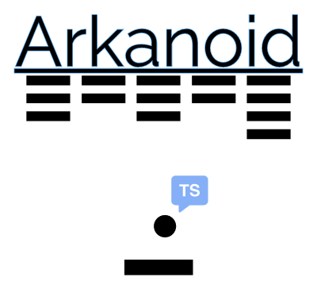

<p align="center">
  <a href="" rel="noopener">
 </a>
</p>

<div align="center">

  
 
[](/LICENSE)

</div>

---
### 📝 Table of Contents
- [🧐 About <a name = "about"></a>](#-about-)
- [🚀 Getting Started <a name = "getting_started"></a>](#-getting-started-)
  - [Prerequisites](#prerequisites)
- [👨‍🚀 Author](#-author)
- [🎉 Acknowledgements <a name = "acknowledgement"></a>](#-acknowledgements-)

## 🧐 About <a name = "about"></a>

There is a very old but nice game as known as *Arkanoid* (a classic video game) played worldwide by many people as myself used to in my not too old days 🤣 🤣. This project is product of a [freeCodeCamp](https://freecodecamp.org) course about learning and praticing **Typescript** and **Parcel bundler**. Thomas Weibenfalk developed this course. Thomas is an experienced programmer and teacher.
The sprites and assets were available beforehand. And code was made through the course.
Great content, you should check it out too!

Watch the full course on the [freeCodeCamp.org YouTube channel (95 minute watch)](https://www.youtube.com/watch?v=7bejSTim38A).

## 🚀 Getting Started <a name = "getting_started"></a>

Install all dependencies:

```
npm install
```

Get eveything up and running:

```
npm run start
```

In your favorite browser, go to:

```
http://localhost:1234
```

### Prerequisites

If you don't have nodeJS installed yet, [download and install from here](https://nodejs.org/en/)

## 👨‍🚀 Author
| [](https://trepichio.github.io) |
|:--------------------------------------------------:|
| [João Trepichio](https://trepichio.github.io)    |
| [🔥 GitHub](https://github.com/trepichio)


## 🎉 Acknowledgements <a name = "acknowledgement"></a>

- References:
  - [freeCodeCamp website](https://freecodecamp.org)
  -  [Create a game using Typescript and Parcel on YouTube (95 minute watch)](https://www.youtube.com/watch?v=7bejSTim38A).
  - [NodeJS](https://nodejs.org/en/)
  - [Typescript](http://typescriptlang.org)
  - [MDN Javascript](https://developer.mozilla.org/en-US/docs/Web/JavaScript)
